# Deploying Multi-OS applications with Docker Enterprise

Docker Enterprise 3.0 is the first Containers-as-a-Service platform to offer production-level support for the integrated management and security of both Linux and Windows Server Containers. It is also the first platform to support both Docker Swarm and Kubernetes orchestration.

In this lab we'll use a Docker Enterprise 3.0 cluster. You will have an environment that is either Linux only, or comprised of Windows and Linux nodes. We'll deploy both a Java web application on Linux and a multi-service application that includes both Windows and Linux components using Docker Swarm. Then, we'll take a look at securing and scaling the application. Finally, we will then deploy the app using Kubernetes.

> **Difficulty**: **Intermediate** (assumes basic familiarity with Docker and Command Line) If you're looking for a basic introduction to Docker, check out [https://training.play-with-docker.com](https://training.play-with-docker.com)

> **Workshop Time**: Approximately 75 minutes

> **Introduction**:
>	* [What is the Docker Platform](#intro1)
>	* [Overview of Orchestration](#intro2)
>		* [Basics of Docker Swarm mode](#intro2.1)
>		* [Basics of Kubernetes](#intro2.2)

> **Tasks**:

> * [Task 1: Configure the Docker Enterprise Cluster](#task1)
>   * [Task 1.1: Accessing PWD](#task1.1)
>   * [Task 1.2: Install a Windows worker node](#task1.2)
>   * [Task 1.3: Create Three Repositories](#task1.3)
> 
 **Note:** If you are also running the optional [Docker Desktop Enterprise  exercises](DESKTOP.md), you can complete Tasks 4 and later after you have completed Task 1 above. 
>    * Tasks 2-4 below are optional since you will push an app to DTR and UCP from the desktop. 
>    * **Task 5 below should still be completed.**

> * [Task 2: Deploy a Java Web App](#task2)
>   * [Task 2.1: Clone the Demo Repo](#task2.1)
>   * [Task 2.2: Build and Push the Linux Web App Image](#task2.2)
>   * [Task 2.3: Deploy the Web App using UCP](#task2.3)
> * [Task 3: Deploy the next version with a Windows node](#task3)
>   * [Task 3.1: Clone the repository](#task3.1)
>   * [Task 3.2: Build and Push Your Java Images to Docker Trusted Registry](#task3.2)
>   * [Task 3.3: Deploy the Java web app with Universal Control Plane](#task3.3)
>   * [Task 3.4: Deploy the Windows .NET App](#task3.4)
> * [Task 4: Deploy to Kubernetes](#task4)
>   * [Task 4.1: Build .NET Core app instead of .NET](#task4.1)
>   * [Task 4.2: Examine the Docker Compose File](#task4.2)
>   * [Task 4.3: Deploy to Kubernetes using the Docker Compose file](#task4.3)
>   * [Task 4.4: Verify the app](#task4.4)
> * [Task 5: Image Scanning](#task5)

## Understanding the Play With Docker Interface


This workshop is only available to people attending a scheduled Docker workshop. This could be arranged through:
* [Docker Meetups](https://events.docker.com/chapters/)
* Conference sessions including this workshop
* Special arrangements between your company and Docker.

The workshop organizer will provide you with the URL to a workshop environment that includes [Docker Enterprise Edition](https://www.docker.com/enterprise-edition). The environment will be based on [Play with Docker](https://labs.play-with-docker.com/).

If none of these apply to you, contact your local [Docker Meetup Chapter](https://events.docker.com/chapters/) and inquire if there are any scheduled workshops. In the interim, you might be interested in the online labs available through the [Play with Docker Classroom](training.play-with-docker.com) portal.

There are three main components to the Play With Docker (PWD) interface:

### 1. Console Access
Play with Docker provides access to the 4 Docker Enterprise hosts in your Cluster. These machines are:

* A Linux-based Docker Enterprise 19.XX Manager node
* Three Linux-based Docker Enterprise 19.XX Worker nodes
* A Windows Server 2019-based Docker Enterprise XX.XX Worker Node

> In some cases, your workshop organizer will have requested a Linux only environment. In this case, feel free skip the Windows sections of the workshop.

By selecting the nodes in the left panel of the user interface, the console will connect to that node.

### 2. Access to your Universal Control Plane (UCP) and Docker Trusted Registry (DTR) servers

Additionally, the PWD screen provides you with a one-click access to the Universal Control Plane (UCP)
web-based management interface as well as the Docker Trusted Registry (DTR) web-based management interface. Clicking on either the `UCP` or `DTR` button will bring up the respective server web interface in a new tab. 

### 3. Session Information

Throughout the lab you will be asked to provide either hostnames or login credentials that are unique to your environment. The user credentials for both `UCP`and `DTR` can be found at the bottom of the PWD screen in the `Session Information` table.

## Document conventions

- When you encounter a phrase in between `<` and `>`  you are meant to substitute in a different value.

	For instance if you see `<dtr hostname>` you would actually type something like `ip172-18-0-7-b70lttfic4qg008cvm90.direct.ee-workshop.play-with-docker.com`


- Wherever n you see the Linux logo, all the following instructions should be completed in your Linux console

	

- Wherever you see the Windows logo, all the subsequent instructions should be completed in your Windows console. These sections can be skipped if you are working with a Linux environment only.

    

## <a name="intro1"></a>Introduction
Docker Enterprise provides an integrated, tested and certified platform for apps running on enterprise Linux or Windows operating systems and cloud providers. Docker Enterprise is tightly integrated to the the underlying infrastructure to provide a native, easy to install experience and an optimized Docker environment. Docker Certified Infrastructure, Containers and Plugins are exclusively available for Docker Enterprise with cooperative support from Docker and the Certified Technology Partners.

#### <a name="intro2"></a>Overview of Orchestration
While it is easy to run an application in isolation on a single machine, orchestration allows you to coordinate multiple machines to manage an application, with features like replication, encryption, load-balancing, service discovery and more. If you've read anything about Docker, you have probably heard of Kubernetes and Docker Swarm mode. Docker Enterprise allows you to use either Docker Swarm mode or Kubernetes for orchestration. 

Both Docker Swarm mode and Kubernetes are declarative: you declare your cluster's desired state, and applications you want to run and where, networks, and resources they can use. Docker Enterprise simplifies this by taking common concepts and moving them to the a shared resource.

#### <a name="intro2.1"></a>Overview of Docker Swarm mode
A Swarm is a group of machines that are running Docker and joined into a cluster. After that has happened, you continue to run the Docker commands you’re used to, but now they are executed on a cluster by a Swarm manager. The machines in a Swarm can be physical or virtual. After joining a Swarm, they are referred to as nodes.

Swarm mode uses managers and workers to run your applications. Managers run the Swarm cluster, making sure nodes can communicate with each other, allocate applications to different nodes, and handle a variety of other tasks in the cluster. Workers are there to provide extra capacity to your applications. In this workshop, you have one manager and three workers.

#### <a name="intro2.2"></a>Overview of Kubernetes

Kubernetes is available in Docker Enterprise 3.0 and included in this workshop. Kubernetes deployments tend to be more complex than Docker Swarm, and there are many component types. UCP simplifies a lot of that, relying on Docker Swarm to handle shared resources. We'll concentrate on Pods and Load Balancers in this workshop, but there's plenty more supported by UCP 3.XX.

## <a name="task1"></a>Task 1: Configure the Docker Enterprise Cluster

The Play with Docker (PWD) environment is almost completely set up, but before we can begin the labs, we need to do two more steps. First we'll add a Windows node to the cluster. We've left the node unjoined so you can see how easy it is to do. Then we'll create two repositories in Docker Trusted Registry.
(The Linux worker nodes are already added to the cluster)

### <a name="task 1.1"></a>Task 1.1: Accessing PWD

1. Navigate to the provided URL using your favorite browser.

2. Fill out the form, and click `submit`. You will then be redirected to the PWD environment.

	It may take a few minutes to provision out your PWD environment. After this step completes, you'll be ready to move on to task 1.2: Install a Windows worker node

### <a name="task1.2"></a>Task 1.2: Join a Windows worker node

Next we are going to add a Windows Server 2016 to the cluster using Docker Swarm.

1. From the main PWD screen click the `UCP` button on the left side of the screen

	> **Note**: This Docker Enterprise install uses the default self-signed certs. Because of this, your browser may display a security warning similar to the message below. This message might appear different depending on your web browser. It is safe to 'acknowledge' and proceed.
	>
	> In a production environment you would use certs from a trusted certificate authority and would not see this screen.
	>
	> 

2. When prompted enter your username and password, use the credentials that are located below the console window on the main PWD screen. The UCP web interface will open in your web browser.

	> **Note**: Once the main UCP screen loads you'll notice there is a red warning bar displayed at the top of the UCP screen, this is an artifact of running in a lab environment. A UCP server configured for a production environment would not display this warning
	>
	> 


3. From the main dashboard screen, click `Add a Node` on the bottom left of the screen

	

4. Select node type "Windows". 

	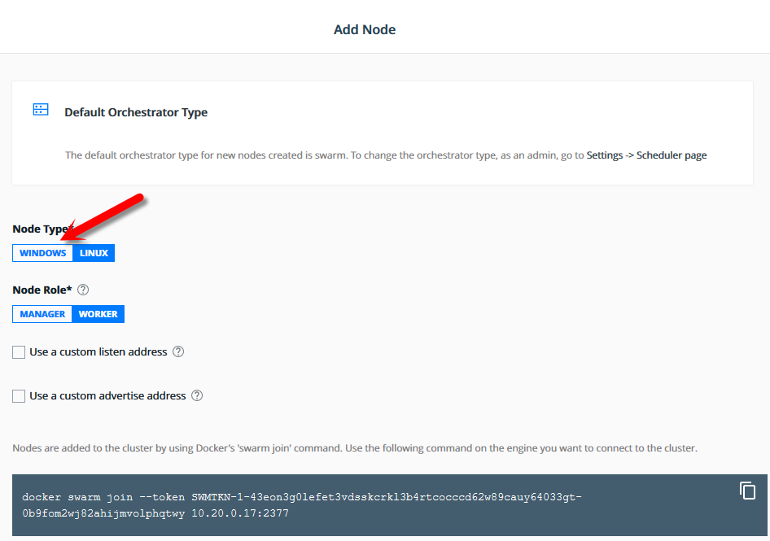

	Under the Step 2 section check the box `I have followed the instructions and I'm ready to join my windows node.` Next, copy the text from the `docker swarm join` command from the dark box shown on the `Add Node` screen. Don't select a custom listen or advertise address.

	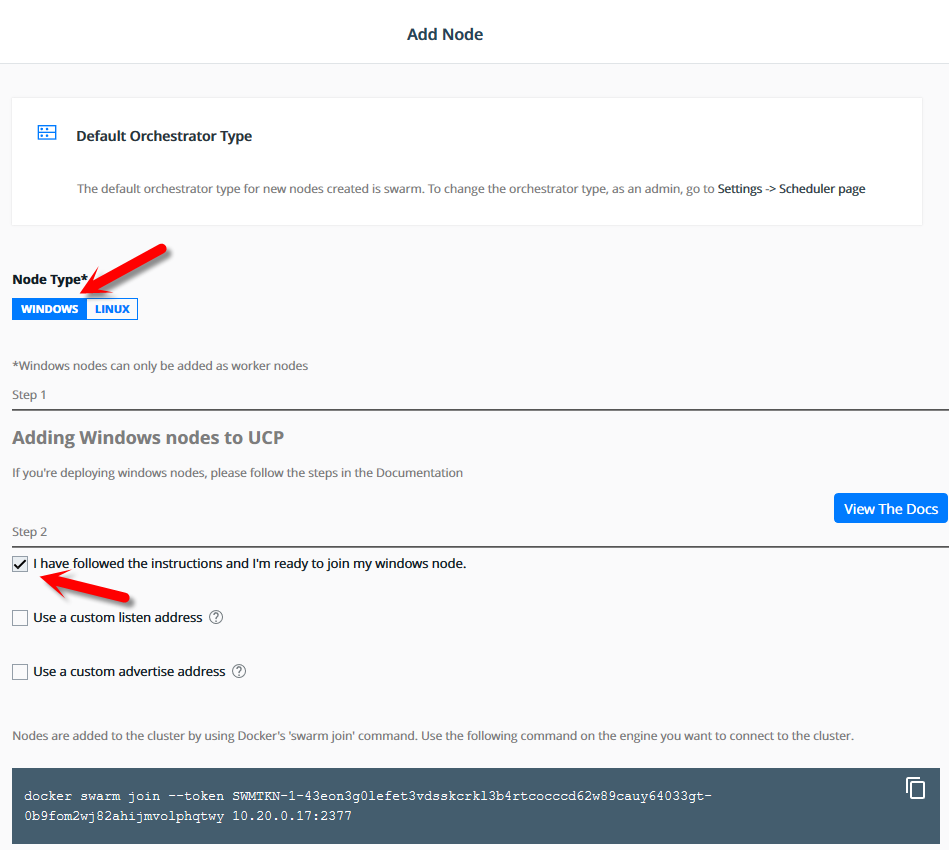

	> **Note** There is an icon in the upper right corner of the dark box that you can click to copy the text to your clipboard.

	> 


	> **Note**: You may notice that there is a UI component to select `Linux` or `Windows`on the `Add Node` screen. In a production environment where you are starting from scratch, there are [a few prerequisite steps](https://docs.docker.com/install/windows/docker-ee/) that need to be completed prior to adding Windows node. However, we've already done these steps in the PWD environment. For this lab, just leave the selection on `Linux` and move on to step 2

	

5. Return to the PWD interface and click the name of your Windows node. This will 			connect the web-based console to your Windows Server 2016 Docker Enterprise host.

	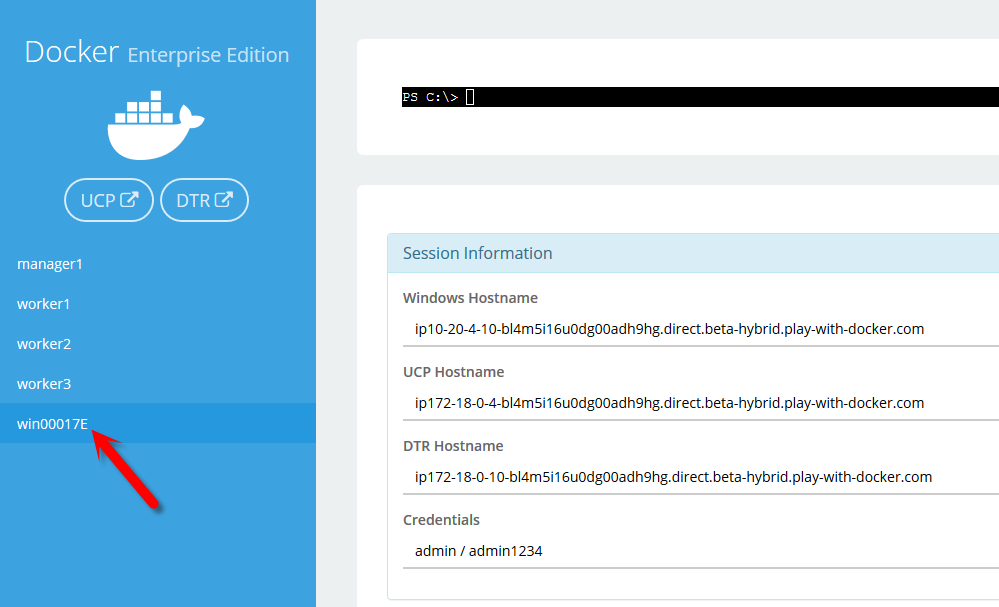

6. Paste the text from Step 4 at the command prompt in the Windows console. (depending on 	your browser, this can be tricky: try the "paste" command from the edit menu instead 	of right clicking or using keyboard shortcuts)

	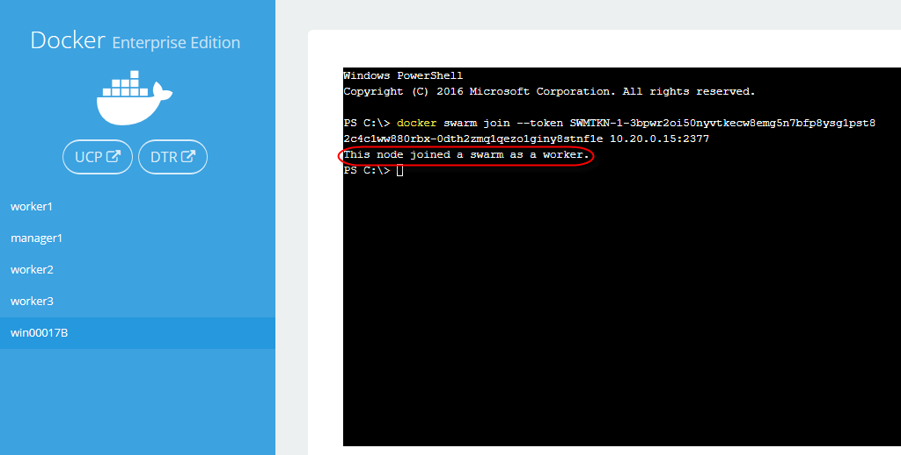

	You should see the message `This node joined a Swarm as a worker.` indicating you've successfully joined the node to the cluster.

	**Note** If the command failed, verify that the command was correctly entered into the Windows console.

7. Switch back to the UCP server in your web browser and click the `x` in the upper right 	corner to close the `Add Node` window

8. You will be taken back to the UCP Dashboard. In the left menu bar, click Shared 	Resources and then select Nodes.

	

	The `Nodes` screen will opeb and you can see 4 `worker` nodes and 1 `manager` listed on your screen.

	> Initially the new worker node will be shown with status `down`. After a minute or two, refresh your web browser to ensure that your Windows worker node has come up as `Healthy UCP worker`
	
	

Congratulations on adding a Windows node to your UCP cluster. Your are now ready to use the worker in either a Swarm or Kubernetes. Next, we'll create a few repositories in Docker Trusted registry.

### <a name="task1.3"></a>Task 1.3: Create Three DTR Repositories

Docker Trusted Registry (DTR) is a special service designed to store and manage your Docker images. In this lab we're going to create three different Docker images, and push them to DTR. Before we can do that, we need to setup repositories in which those images will reside.

However, before we create the repositories, we do want to restrict access to them. Since we have two distinct app components, a Java web app (with a database), and a .NET API, we want to restrict access to them to the team that develops them, as well as the administrators. To do that, we need to create two users and then two organizations.

1. In the PWD web interface, click the `DTR` button on the left side of the screen.

	> **Note**: As with UCP before, DTR is also using self-signed certs. It's safe to click through any browser warning you might encounter.

2. From the main DTR page, click users and then the New User button.

	

3. Create a new user, `java_user` and give it a password you'll remember. I used `user1234`. Be sure to save the user.

	

	Then do the same for a `dotnet_user`. You should see a similar users as below.

	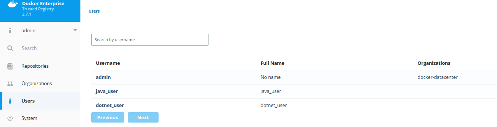

4. In the left Menu, select Organizations

	

5. Press the `New organization` button, name it `java`, and click save.

    

	Then do the same with dotnet and you'll have two organizations.

	

6. Now you get to add a repository! Click on the java organization, select Repositories and then `New repository`

	

7. Name the repository `java_web`. Provide a Description and click `Save`.

	> Note the repository is listed as "Public" but that means it is publicly viewable by users of DTR. It is not available to the general public.

	

8. Now it's time to create a team so you can restrict access to who administers the images. Select the Members Menu Tab and Press `Add user` button. Start typing in java in the Search by Username box.. Select the `java_user` when it comes up. Select `Save`.

	

9. Next select the `java` organization and press the Teams Green `+` button to create a `web` team.

	

10. Select the `web` Team and click the `Add user` button. Add the `java_user` user to the `web` team and click save.

	

	

11. Next select the `web` team and select the `Repositories` tab and click `New repository`. Select `Add Existing repository` and click in the `Repository Name` field and choose the `java_web` repository. You'll see the `java` account is already selected. Then select `Read/Write` permissions so the `web` team has permissions to push images to this repository. Finally click `Save`.

	

12. Now add a `New` repository also owned by the web team and call it `database`. This can be done directly from the web team's `Repositories` tab by clicking the `New repository` button, select Add `New` repository and name the repository `database`. Be sure to grant `Read/Write` permissions for this repository which will be part of the `web` team as well.

	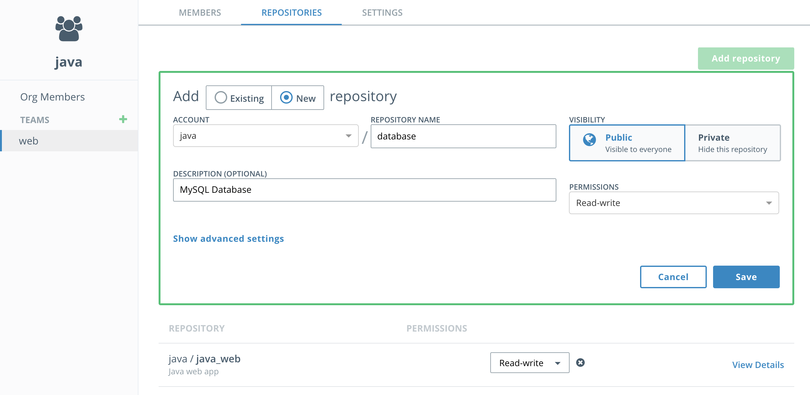

13. Repeat 4-11 above to create the same structure in the `dotnet` organization. First, create the `api` Team, add the `dotnet_user` as member to to the `api` Team and create the repository `dotnet_api`. Grant `read/write` permissions for the `dotnet_api` repository to the `api` team.

14. From the main DTR page, click Repositories, you will now see all three repositories listed.
	
	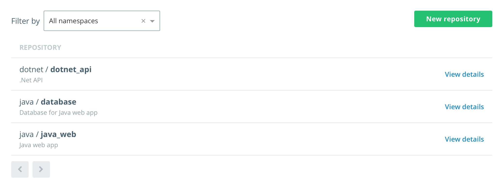

15. (optional) If you want to check out security scanning in Task 5, you should turn on scanning now so DTR downloads the database of security vulnerabilities. In the left-hand panel, select `System` and then the `Security` tab. Select `ENABLE SCANNING` method for installation and updates is `Online` and click `Enable Online Syncing`

	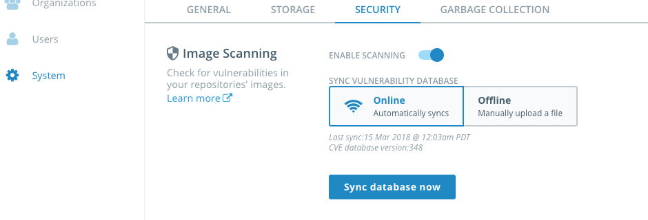

Congratulations, you have created three new repositories in two new organizations, each with one team and a user each.

## <a name="task2"></a>Task 2: Deploy a Java Web App with Universal Control Plane

Now that we've completely configured our cluster, let's deploy a web app. The Signup application is a basic Java CRUD (Create, Read, Update, Delete) application that uses Spring and Hibernate to transact queries against MySQL. It runs in Tomcat.

### <a name="task2.1"></a> Task 2.1: Clone the Demo Repo


1. From PWD click on the `worker1` link on the left to connect your web console to the UCP Linux worker node. Click the terminal window and hit the enter or space key to activate the terminal window.

2. Before we do anything, let's configure an environment variable for the DTR URL/DTR hostname. You may remember that the session information from the Play with Docker landing page (Below the terminal window). Select and copy the URL for the DTR hostname.

	

3. Set an environment variable `DTR_HOST` using the DTR host name defined on your Play with Docker landing page:

	```bash
	export DTR_HOST=<dtr hostname>
	echo $DTR_HOST
	```

4. Now use git to clone the workshop repository.

	```bash
	git clone https://github.com/dockersamples/hybrid-app.git
	```

	You should see something like this as the output:

	```bash
	Cloning into 'hybrid-app'...
	remote: Counting objects: 389, done.
	remote: Compressing objects: 100% (17/17), done.
	remote: Total 389 (delta 4), reused 16 (delta 1), pack-reused 363
	Receiving objects: 100% (389/389), 13.74 MiB | 3.16 MiB/s, done.
	Resolving deltas: 100% (124/124), done.
	Checking connectivity... done.
	```

	You now have the necessary demo code on your worker host.

### <a name="task2.2"></a> Task 2.2: Build and Push the Linux Web App Images


1. Change into the `java-app` directory.

	```bash
	cd ./hybrid-app/java-app/
	```

2. Use `docker build` to build your Docker image.

	```bash
	docker build -t $DTR_HOST/java/java_web .
	```
> Note the final "." in the above command. The "." is the build context, specifically the current directory. One of the most common mistakes even experienced users make is leaving off the build context.

The `-t` tags the image with a tag or name. In our case, the name indicates which DTR server and under which organization's repository the image will reside.

> **Note**: Feel free to examine the Dockerfile in this directory if you'd like to see how the image is being built.

There will be quite a bit of output. The Dockerfile describes a two-stage build. In the first stage, a Maven base image is used to build the Java app. But to run the app you don't need Maven or any of the JDK stuff that comes with it. So the second stage takes the output of the first stage and puts it in a much smaller Tomcat image.

3. Log into your DTR server from the command line.
 
	First use the `dotnet_user` and password `user1234` which isn't part of the java organization

	```bash
	docker login $DTR_HOST

	Username: <your username>
	Password: <your password>
	Login Succeeded
	```
	
	Use `docker push` to upload your image up to Docker Trusted Registry.
	
	```bash
	docker push $DTR_HOST/java/java_web
	```
	
	```bash
	docker push $DTR_HOST/java/java_web

	The push refers to a repository [.<dtr hostname>/java/java_web]
	8cb6044fd4d7: Preparing
	07344436fe27: Preparing
	...
	e1df5dc88d2c: Waiting
	denied: requested access to the resource is denied
	```

	As you can see, the access control that you established in the [Task 1.3](#task1.3) prevented you from pushing to this repository.	

4. Now try logging in using `java_user`and password `user1234` then use `docker push` to upload your image up to Docker Trusted Registry.

	```bash
	docker push $DTR_HOST/java/java_web
	```

	The output should be similar to the following:

	```bash
	The push refers to a repository [<dtr hostname>/java/java_web]
	feecabd76a78: Pushed
	3c749ee6d1f5: Pushed
	af5bd3938f60: Pushed
	29f11c413898: Pushed
	eb78099fbf7f: Pushed
	latest: digest: sha256:9a376fd268d24007dd35bedc709b688f373f4e07af8b44dba5f1f009a7d70067 size: 1363
	```

	Success! Because you are using a user name that belongs to the right team in the right organization, you can push your image to DTR.

5. In your web browser head back to DTR and click `View Details` next to your `java_web` repository to see the details of the repository.

	> **Note**: If you've closed the tab with your DTR server, just click the `DTR` button from the PWD page.

6. Click on `Tags` from the horizontal menu. Notice that your newly pushed image is now on your DTR.

	

7. Next, build the MySQL database image. Change into the database directory.

	```bash
	cd ../database
	```

8. Use `docker build` to build your Docker image.

	```bash
	docker build -t $DTR_HOST/java/database .
	```
> Note the final "." in the above command. The "." is the build context, specifically the current directory. One of the most common mistakes even experienced users make is leaving off the build context.

9. Use `docker push` to upload your image up to Docker Trusted Registry.
	```bash
	docker push $DTR_HOST/java/database
	```

10. In your web browser head back to your DTR server, select your `java/database` repository and click `Tags` from the horizontal menu. Notice that your newly pushed image is now in your DTR.


### <a name="task2.3"></a> Task 2.3: Deploy the Web App using UCP


The next step is to run the app in Swarm. **Remember**, the application has two components, the web front-end and the database. In order to connect to the database, the application needs a password. If you were just running this in development you could easily pass the password around as a text file or an environment variable. But keys and passwords should **never** be be shared in a production environment. Instead, we're going to create an encrypted secret which will allow us to strictly control access.

1. Go back to the first Play with Docker tab. Click on the UCP button. You'll receive the same `https` warning that you have before. Acknowledge the warnings and log in. You'll see the Universal Control Panel dashboard.

	

2.  There's a lot of information on this page about managing the cluster. You can take a moment to explore around and get familiar with the layout. 

	Next, click on `Swarm` and select `Secrets`.

	

3. Click the `Create` button to access the `Create Secret` screen. Type `mysql_password` in `Name` and `Dockercon!!!` in `Content`, then click `Create` in the lower right corner. For production environments, more complex passwords should be used. You'll notice the content box allows you to create structured content that will be encrypted with the secret.

	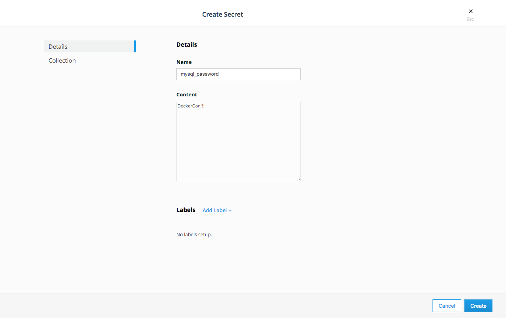

4. Next we're going to create two networks. First click on `Networks` under the `Swarm` section on the left panel, and select `Create` in the upper right corner of the page. You'll be presented with a `Create Network` form. Name this network `back-tier`. Leave everything else the default and click `Create` in the lower right.

	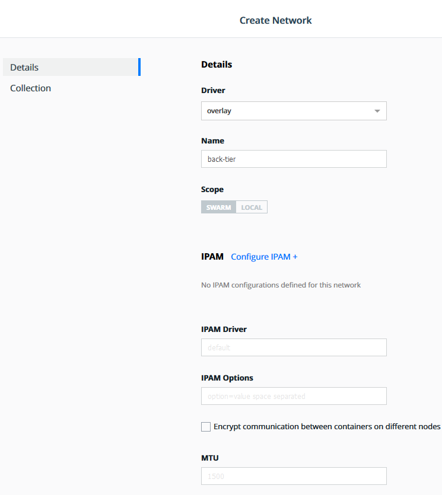
	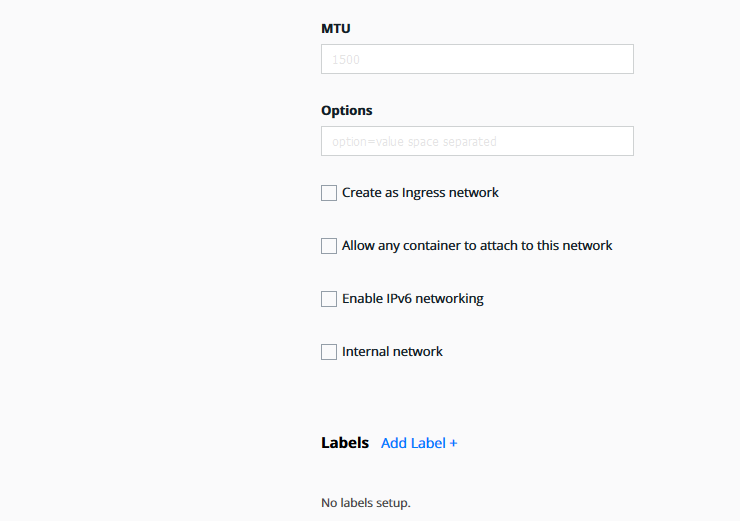

5. Repeat step 4 but with a new network called `front-tier`.

6. Now we're going to use the fast way to create your application using `Stacks`. In the left panel, click `Shared Resources`-> `Stacks` and then `Create Stack` in the upper right corner.

	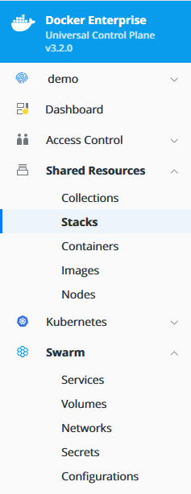

7. Name your stack `java_web` and select `Swarm Services` for your `Orchestrator Mode`. Leave `Application File Mode` as default, then click `Next`. 

	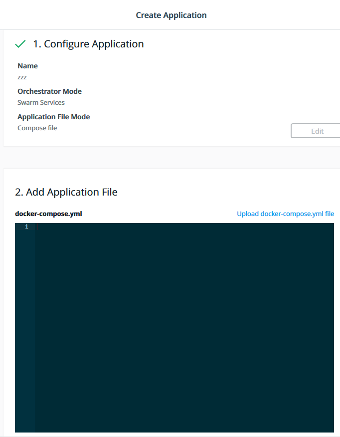

Below is a sample `.yml` file that you can use to populate your file. 

> **Note** : Before pasting the content into your `compose.yml` edit box, you'll need to modify a couple of items. Each of the images is defined as `<dtr hostname>/java/<something>`, which you'll need to change to the `<dtr hostname>` found on the Play with the Docker landing page for your session.

> It will look something like this:
`ip172-18-0-21-baeqqie02b4g00c9skk0.direct.ee-beta2.play-with-docker.com`

> This can be done right from the `Add Application File` edit box on the `UCP Create Application` form.

```yaml
    version: "3.3"

    services:

      database:
        image: <dtr hostname>/java/database
        # set default mysql root password, change as needed
        environment:
          MYSQL_ROOT_PASSWORD: mysql_password
        # Expose port 3306 to host. 
        ports:
          - "3306:3306" 
        networks:
          - back-tier

      webserver:
        image: <dtr hostname>/java/java_web
        ports:
          - "8080:8080" 
        networks:
          - front-tier
          - back-tier

    networks:
      back-tier:
        external: true
      front-tier:
        external: true

    secrets:
      mysql_password:
        external: true
```

Then click `Create` in the lower right corner of the window.

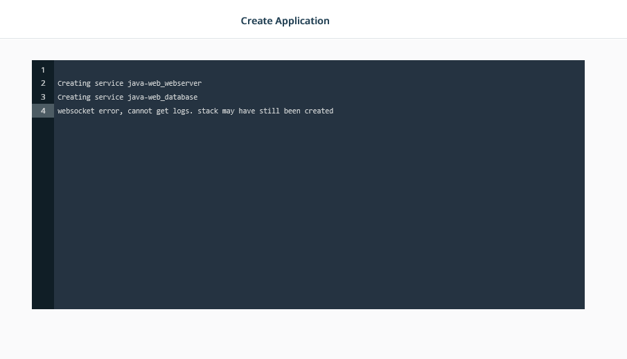

Once deployed, click `Done`.

> You might see a websocket error, but the stack is still being created. You can safely ignore this error.

8. Congratulations! You've deployed your first app! Now it's time to go and test the functionality. Open a new tab or browser window and enter the `UCP Hostname` and append `:8080/java-web` to the end of the URL. 

`E.g. http://ip172-18-0-21-baeqqie02b4g00c9skk0.direct.ee-beta2.play-with-docker.com:8080/java-web` 


9. Delete your `java_web` application stack.

## <a name="task3"></a>Task 3: Deploy the next version with a Windows node

Now that the app has been moved and updated, we'll be adding an user sign-in API. To illustrate Docker Enterprise's cross-platform capabilities, we'll be performing this deployment using a Windows container.

> If your workshop organizer requested a Windows only environment, you can skip ahead to <a href="#task4">Task 4</a>.

### <a name="task3.1"></a> Task 3.1: Clone the repository


1. Because this is a Windows container, it has to be deployed on a Microsoft Windows host. Switch back to the main Play with Docker page and select the name of the Windows worker. 

	First verify that Docker is `running` - it runs as a background Windows Service. This can be done by the following command:

	```powershell
	Get-Service docker
	```
	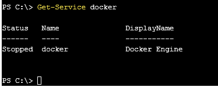

	If the service is not running, it can be started with the following command:

	```powershell
	Start-Service docker
	```
	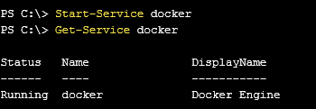

	Next, clone the repository again onto this host:

	```powershell
	PS C:\> git clone https://github.com/dockersamples/hybrid-app.git
	```

2. Set an environment variable for the DTR host name. Similar to what you did for the Java app, this will simplify a few steps. Copy the DTR host name again and create the environment variable. For instance, if your DTR host FQDN is `"ip172-18-0-17-bajlvkom5emg00eaner0.direct.ee-beta2.play-with-docker.com"` you would type:

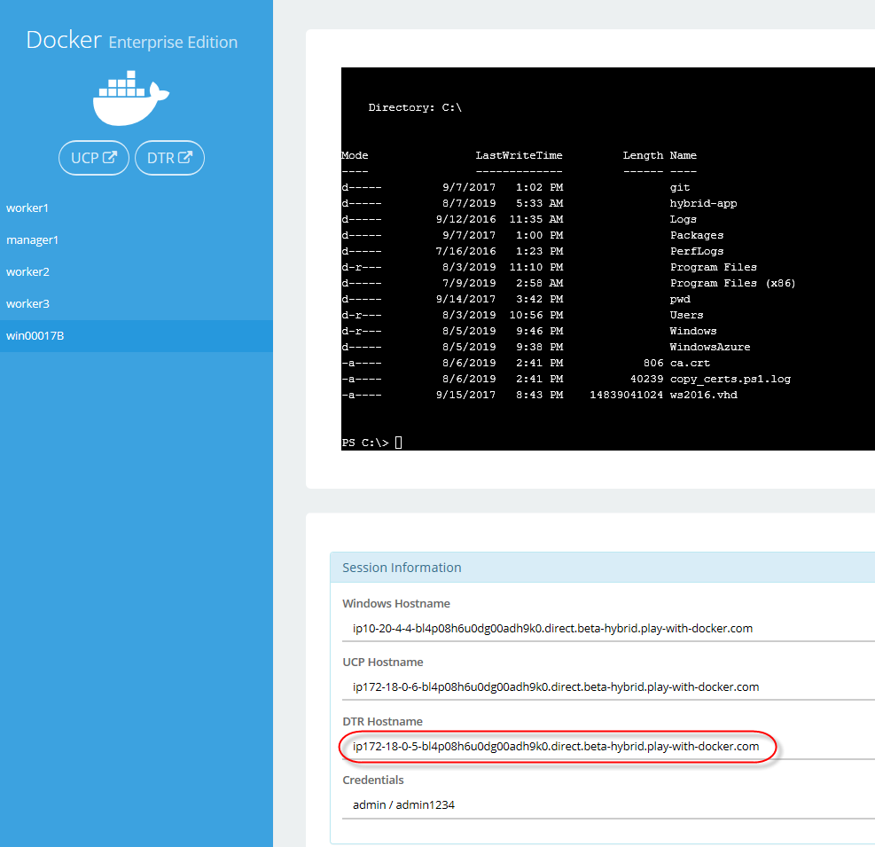

```powershell
PS C:\> $env:DTR_HOST="ip172-18-0-17-bajlvkom5emg00eaner0.direct.ee-beta2.play-with-docker.com"
```


> **Note** ensure the DTR hostname includes quotes otherwise the command will fail `""` 


### <a name="task3.2"></a> Task 3.2: Build and Push Windows Images to Docker Trusted Registry


1. Change your path to `c:\hybrid-app\netfx-api`.

	```powershell
	PS C:\> cd c:\hybrid-app\netfx-api\
	```

2. Use `docker build` to build your Windows image.

	```powershell
	PS C:\hybrid-app\netfx-api> docker build -t $env:DTR_HOST/dotnet/dotnet_api .
	```	
	
   > **Note** the final "." in the above command. The `"."` is the build context, specific to the current directory. One of the most common mistakes even experienced users make is leaving off the build context. 
   
   > **Note**: Feel free to examine the Dockerfile in this directory if you'd like to see how the image is being built.

	Your output should be similar to what is shown below

	```powershell
	PS C:\hybrid-app\netfx-api> docker build -t $env:DTR_HOST/dotnet/dotnet_api .

	Sending build context to Docker daemon  415.7kB
	Step 1/8 : FROM microsoft/iis:windowsservercore-10.0.14393.1715
	 ---> 590c0c2590e4

	<output snipped>

	Removing intermediate container ab4dfee81c7e
	Successfully built d74eead7f408
	Successfully tagged <dtr hostname>/dotnet/dotnet_api:latest
	```

	> **Note**: It will take a few minutes for your image to build.

4. Log into the Docker Trusted Registry

	```powershell
	PS C:\hybrid-app\netfx-api> docker login $env:DTR_HOST
	Username: dotnet_user
	Password: user1234
	Login Succeeded
	```

5. Push your new image up to Docker Trusted Registry(DTR).

	```powershell
	PS C:\hybrid-app\netfx-api> docker push $env:DTR_HOST/dotnet/dotnet_api
	The push refers to a repository [<dtr hostname>/dotnet/dotnet_api]
	5d08bc106d91: Pushed
	74b0331584ac: Pushed
	e95704c2f7ac: Pushed
	669bd07a2ae7: Pushed
	d9e5b60d8a47: Pushed
	8981bfcdaa9c: Pushed
	25bdce4d7407: Pushed
	df83d4285da0: Pushed
	853ea7cd76fb: Pushed
	55cc5c7b4783: Skipped foreign layer
	f358be10862c: Skipped foreign layer
	latest: digest: sha256:e28b556b138e3d407d75122611710d5f53f3df2d2ad4a134dcf7782eb381fa3f size: 2825
	```

6. Verify your newly pushed image within the DTR web interface.

### <a name="task3.3"></a> Task 3.3: Deploy the Java web app


1. Firstly, we need to update our Java web app to take advantage of the .NET API. Switch back to `worker1` and change directories to the `java-app-v2` directory. Repeat steps 1,2, and 4 from [Task 2.2](#task2.2) but add a tag `:2` to your build and pushes:

	```bash
	$ docker login
	username: java_user
	password: user1234
	
	$ docker build -t $DTR_HOST/java/java_web:2 .
	$ docker push $DTR_HOST/java/java_web:2
	```
	> **Note** the final "." in the above `docker build` command. The "." is the build context, specifically the current directory. One of the most common mistakes even experienced users make is leaving off the build context.

	This will push a different version of the app, version 2, to the same `java_web` repository.

2. Next repeat the steps 6-8 from [Task 2.3](#task2.3), but use this `Compose` file instead:

	> **Note** : Before pasting the content into your `compose.yml` edit box, you'll need to modify a couple of items. Each of the images is defined as `<dtr hostname>/java/<something>`, which you'll need to change to the `<dtr hostname>` found on the Play with the Docker landing page for your session.

	> It will look something like this:
	`ip172-18-0-21-baeqqie02b4g00c9skk0.direct.ee-beta2.play-with-docker.com`

	> This can be done right from the `Add Application File` edit box on the `UCP Create Application` form.

	```yaml
    version: "3.3"

    services:

      database:
        image: <dtr hostname>/java/database
        # set default mysql root password, change as needed
        environment:
          MYSQL_ROOT_PASSWORD: mysql_password
        # Expose port 3306 to host. 
        ports:
          - "3306:3306" 
        networks:
          - back-tier

      webserver:
        image: <dtr hostname>/java/java_web:2
        ports:
          - "8080:8080" 
        networks:
          - front-tier
          - back-tier
        environment:
          BASEURI: http://dotnet-api/api/users

      dotnet-api:
        image: <dtr hostname>/dotnet/dotnet_api
        ports:
          - "57989:80"
        networks:
          - front-tier
          - back-tier

    networks:
      back-tier:
        external: true
	  front-tier:
	    external: true

    secrets:
      mysql_password:
        external: true
	```
**Congratulations, you deployed a multi-acrhictecture application on Docker  Swarm** 

3. Navigate to `Shared Resources -> Stacks -> java_web` then click the `services` tab.

	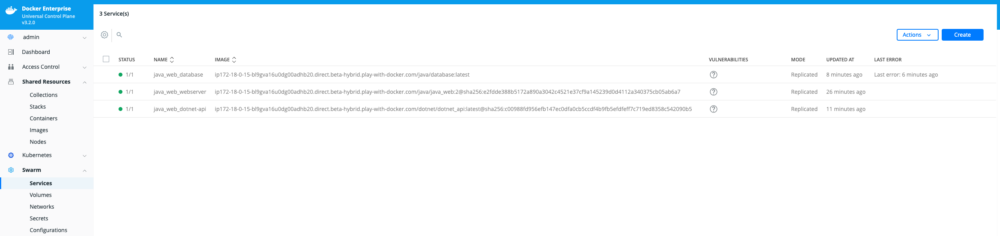

4. After a couple mintues you should see all the services green and deplyoed.

5. Once tested, delete the stack.

## <a name="task4"></a>Task 4: Deploy to Kubernetes

Now that we have built, deployed and scaled a multi OS application to Docker Enterprise using Swarm mode for orchestration, let's look at how to use Docker Enterprise with Kubernetes.

Docker Enterprise lets you choose the orchestrator used to deploy and manage your application between Swarm and Kubernetes. In the previous tasks we've used Swarm for our  orchestration. In this section we will deploy the application to Kubernetes and see how Docker Enterprise exposes Kubernetes concepts.

Before moving forward we need to make sure that our cluster worker nodes can schedule Kubernetes workloads. Navigate to the nodes section:

* `UCP > Shared Resources > Nodes`

	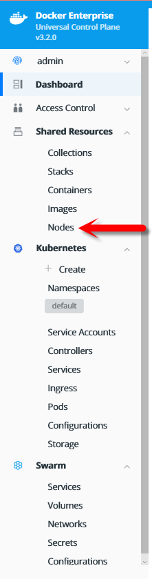

	You'll notice that the scheduler type of `worker2` and `worker3` is set to Swarm. 

	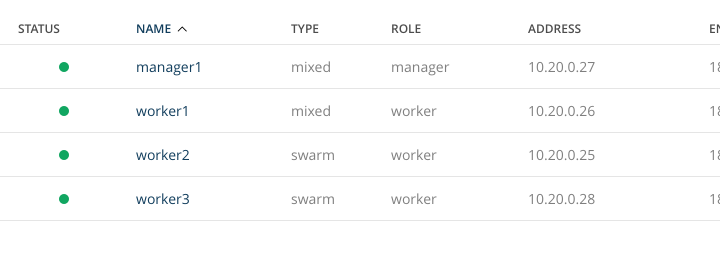

	Click on the `worker2` node and change it's orchestration type to `mixed` using the gear icon on the top right corner and click `Save`. 
	
	Repeat the same step for `worker3`.
	
	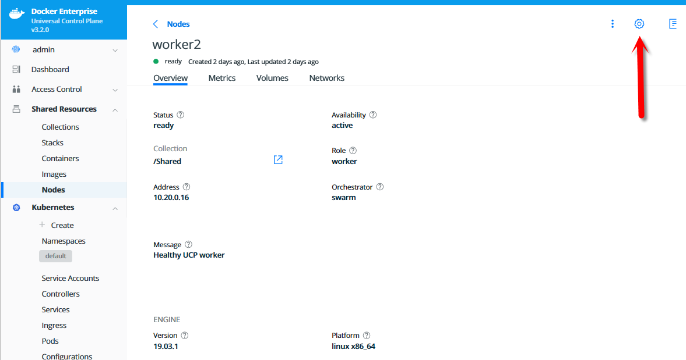

	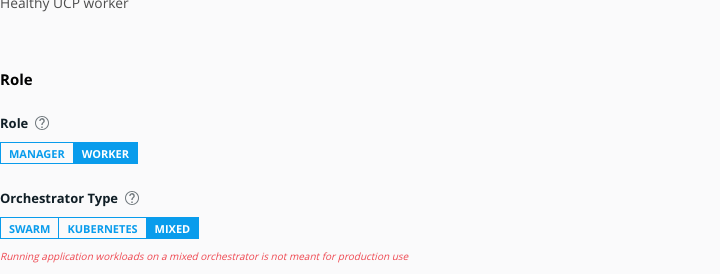


	Now your cluster is configured to run both Kuberentes and Swarm workloads


### <a name="task4.1"></a>Task 4.1: Build .NET Core app instead of .NET


For now Kubernetes does not support Windows workloads in production, so we will start by porting the .NET part of our application to a Linux container using .NET Core.

1. From the Play with Docker landing page, click on `worker1` and CD into the `hybrid-app/dotnet-api` directory. 

	```bash
	cd ~/hybrid-app/dotnet-api/
	```

2. Use `docker build` to build your Linux image.

	```bash
	docker build -t $DTR_HOST/dotnet/dotnet_api:core .
	```
	> Note the final "." in the above command. The "." is the build context, specifically the current directory. One of the most common mistakes even experienced users make is leaving off the build context.

	> **Note**: Feel free to examine the Dockerfile in this directory if you'd like to see how the image is being built. Also, we used the `:core` tag so that the repository has two versions, the original with a Windows base image, and this one with a Linux .NET Core base image.

	Your output should be similar to what is shown below

	```bash
	Sending build context to Docker daemon   29.7kB
	Step 1/10 : FROM microsoft/aspnetcore-build:2.0.3-2.1.2 AS builder
	2.0.3-2.1.2: Pulling from microsoft/aspnetcore-build
	723254a2c089: Pull complete

		<output snipped>

	Removing intermediate container 508751aacb5c
	Step 7/10 : FROM microsoft/aspnetcore:2.0.3-stretch
	2.0.3-stretch: Pulling from microsoft/aspnetcore

	Successfully built fcbc49ef89bf
	Successfully tagged ip172-18-0-8-baju0rgm5emg0096odmg.direct.ee-beta2.play-with-docker.com/dotnet/dotnet_api:latest
	```

	> **Note**: It will take a few minutes for your image to build.

4. Log into Docker Trusted Registry

	```bash
	$ docker login $DTR_HOST
	Username: dotnet_user
	Password: user1234
	Login Succeeded
	```

5. Push your new image up to Docker Trusted Registry.

	```bash
	$ docker push $DTR_HOST/dotnet/dotnet_api:core
	The push refers to a repository [<dtr hostname>/dotnet/dotnet_api]
	5d08bc106d91: Pushed
	74b0331584ac: Pushed
	e95704c2f7ac: Pushed
	669bd07a2ae7: Pushed
	d9e5b60d8a47: Pushed
	8981bfcdaa9c: Pushed
	25bdce4d7407: Pushed
	df83d4285da0: Pushed
	853ea7cd76fb: Pushed
	55cc5c7b4783: Skipped foreign layer
	f358be10862c: Skipped foreign layer
	latest: digest: sha256:e28b556b138e3d407d75122611710d5f53f3df2d2ad4a134dcf7782eb381fa3f size: 2825
	```

6. You may check your repositories in the DTR web interface to see the newly pushed image.

### <a name="task4.2"></a>Task 4.2: Examine the Docker Compose File


Docker Enterprise lets you deploy Kubernetes applications natively using the Kubernetes deployment descriptors. This can be done by providing the yaml files in the UI, or using the `kubectl` CLI tool.

However, many developers choose `docker-compose` to build and test their applications. Having to create Kubernetes deployment descriptors as well as maintaining them in sync with the Docker Compose file, is a  tedious and error prone process.

In order to simply developent and operations tasks, Docker Enterprise lets you deploy an application defined with a Docker Compose file as a Kubernetes workload. Internally Docker Enterprise uses the official Kubernetes extension mechanism by defining a [Custom Resource Definition](https://kubernetes.io/docs/tasks/access-kubernetes-api/extend-api-custom-resource-definitions/) (CRD) defining a stack object. When you post a Docker Compose stack definition to Kubernetes in Docker Enterprise, the CRD controller takes the stack definition and translates it to Kubernetes native resources like pods, controllers and services.

We'll use a Docker Compose file to instantiate our application. This is the same file you used in a prior task, with a few changes. 
* We will switch the .NET Docker Windows image with the .NET Core Docker Linux image we just built. 
* Create a new secret `mysql-secret` with `DockerCon!!!` as the password. 

Follow the instructions above but use `-` instead of `_` as Kubernetes doesn't allow underscores.

Let's look at the Docker Compose file in `app/docker-stack.yml`.


```yaml
version: '3.3'

services:
  database:
    deploy:
      placement:
        constraints:
        - node.platform.os == linux
    image: <dtr hostname>/java/database
    environment:
      MYSQL_ROOT_PASSWORD: mysql-password
    networks:
      back-tier:
    ports:
    - published: 32768
      target: 32768

  dotnet-api:
    deploy:
      placement:
        constraints:
        - node.platform.os == linux
    image: <dtr hostname>/dotnet/dotnet_api:core
    networks:
      back-tier:
    ports:
    - published: 32769
      target: 80

  java-web:
    deploy:
      placement:
        constraints:
        - node.platform.os == linux
    image: <dtr hostname>/java/java_web:2
    environment:
      BASEURI: http://dotnet-api/api/users
    networks:
      back-tier:
      front-tier:
    ports:
    - published: 32770
      target: 8080

networks:
  back-tier:
    external: true
  front-tier:
    external: true

secrets:
  mysql-password:
    external: true
```


### <a name="task4.3"></a>Task 4.3: Deploy to Kubernetes using the Docker Compose file


1. Create a new secret `UCP -> Swarm -> Secrets` Create a secret`mysql-secret` with  `DockerCon!!!` as the password

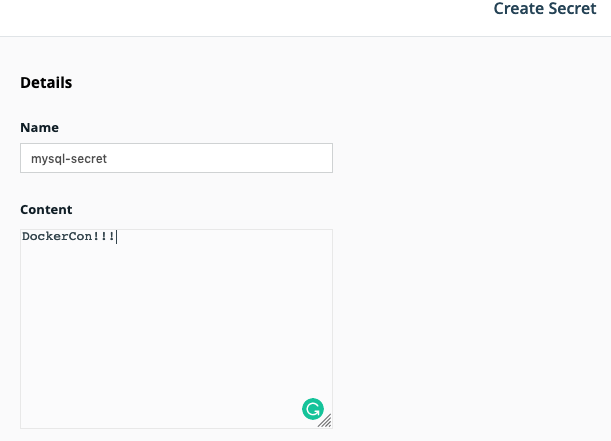

2. Login to UCP, and select `Shared resources >  Stacks`.

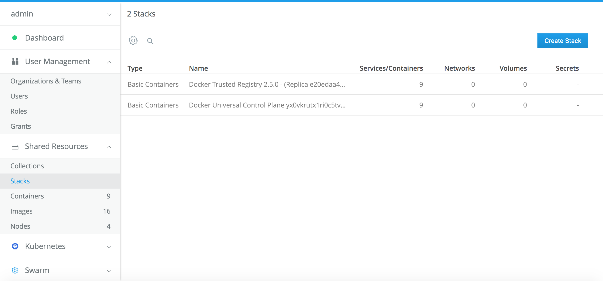

3. Click **`Create Stack`**. Fill name: **`hybrid-app`**, mode: **`Kubernetes Workloads`**, namespace: **`Default`**.

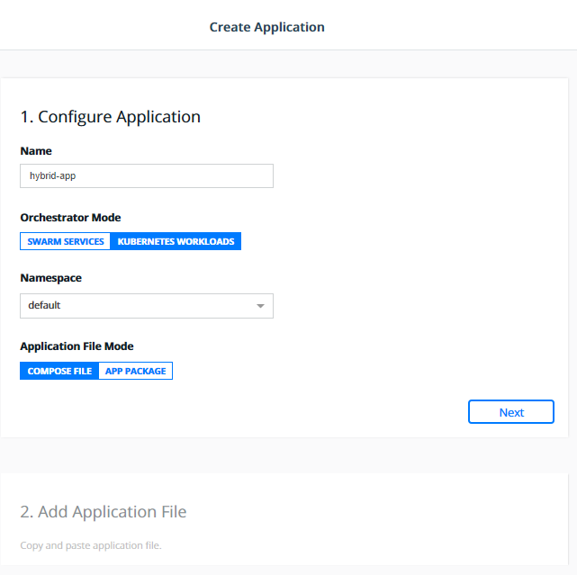

4. Copy the below `app/docker-stack.yml` into the `Add Application File` window and click `Create`
> **NOTE: **Change the images for the dotnet-api and java-app services for the ones we just built. And remember to change `<dtr hostname>` to the long DTR hostname listed on the landing page for your Play with Docker instance.

```yaml
version: '3.3'

services:
  database:
    deploy:
      placement:
        constraints:
        - node.platform.os == linux
    image: <dtr hostname>/java/database
    environment:
      MYSQL_ROOT_PASSWORD: mysql-password
    networks:
      back-tier:
    ports:
    - published: 32768
      target: 32768

  dotnet-api:
    deploy:
      placement:
        constraints:
        - node.platform.os == linux
    image: <dtr hostname>/dotnet/dotnet_api:core
    networks:
      back-tier:
    ports:
    - published: 32769
      target: 80

  java-web:
    deploy:
      placement:
        constraints:
        - node.platform.os == linux
    image: <dtr hostname>/java/java_web:2
    environment:
      BASEURI: http://dotnet-api/api/users
    networks:
      back-tier:
      front-tier:
    ports:
    - published: 32770
      target: 8080

networks:
  back-tier:
    external: true
  front-tier:
    external: true

secrets:
  mysql-password:
    external: true
```

5. To see the stack being created, navigate to `Kubernetes > Pods`. You should see the stack being created.

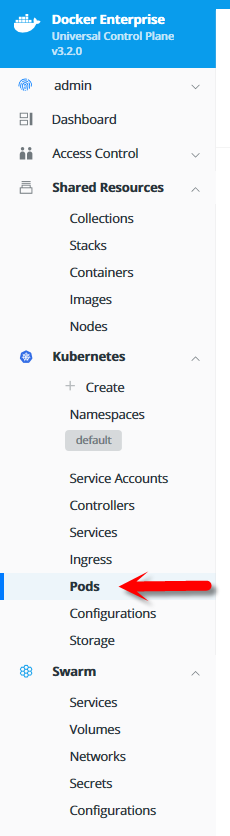

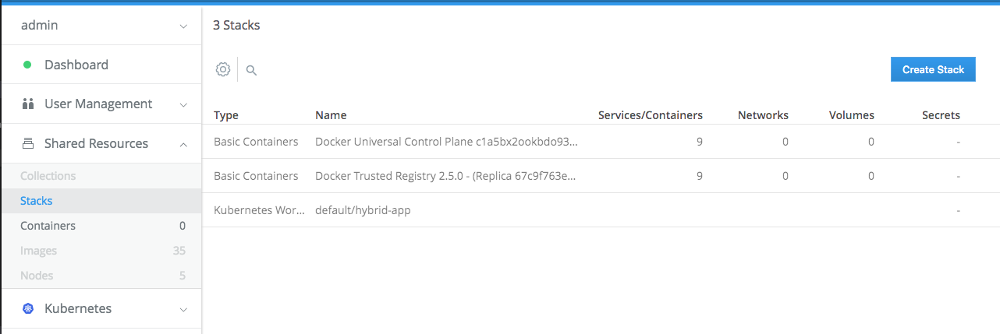

6. Click on the `hybrid-app` stack to see the details.

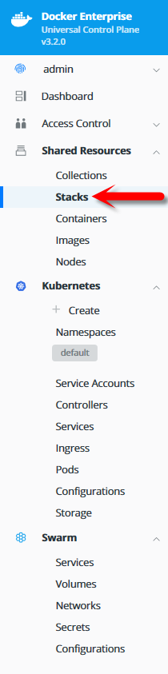

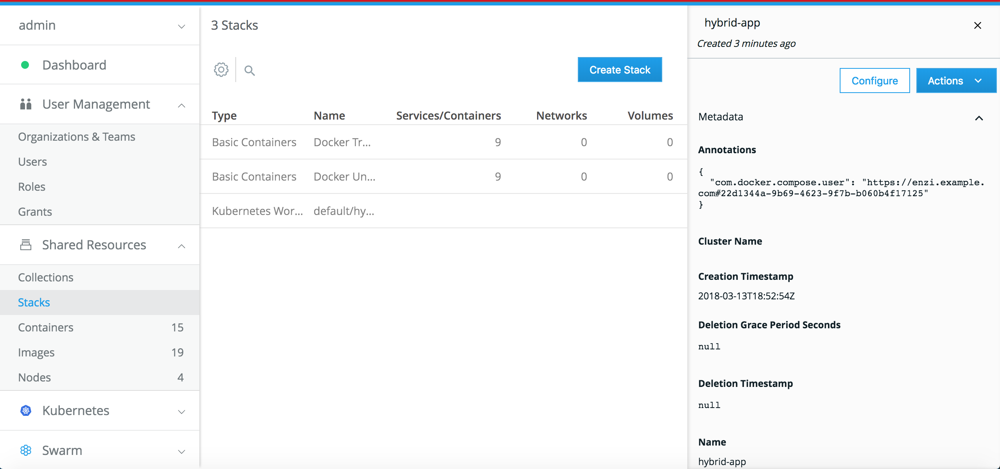

### <a name="task4.4"></a>Task 4.4: Verify the app


1. Navigate to `Kubernetes > Pod` to verify the pods are being deployed.

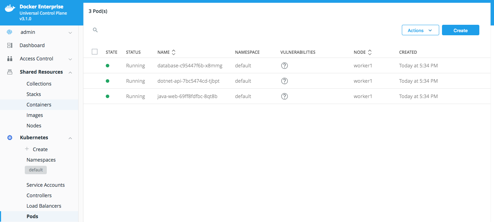

2. Navigate to `Kubernetes > Controllers` to verify the deployments and ReplicaSets.

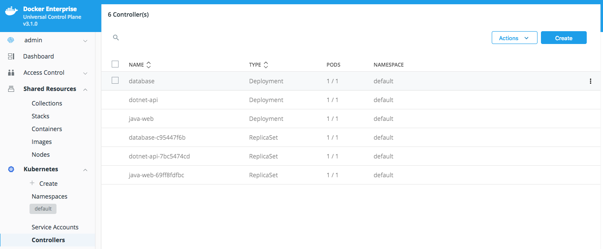

3. Navigate to `Kubernetes > Load Balancers` to verify the Kubernetes services that have been created.

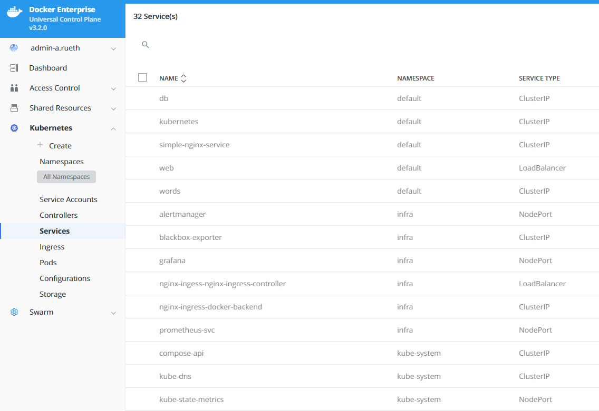

4. Click on `java-web-published` to the the details of the public load balancer created for the Java application.

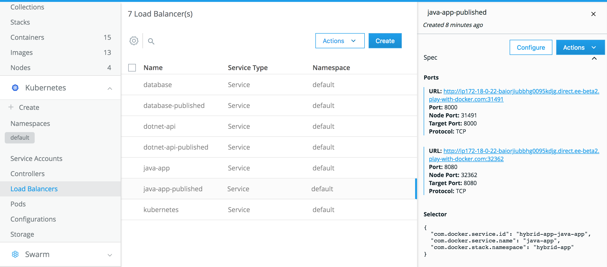

5. The `Node Port` 32770 is exposed. Note that this is different than previous implementations due to Kubernetes NodePort range limitations. Open a new browser tab, paste in the `UCP Hostname` from the Play with Docker landing page and add `:32770/java-web/` at the end of the url. You should be led to the running application.

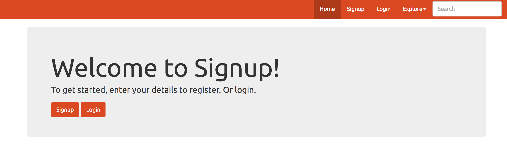

## <a name="task5"></a>Task 5: Image Scanning

Security is crucial for all organizations and covers a wide range of topics. Far too many to cover them in-depth in this workshop. We'll be examining just one of the features that Docker Enterprise provides to assist you in building a secure software supply chain: `Image Scanning` which checks for vulnerabilities in your images.

1. If you turned on security in Task 1.3 step 14 you can skip this step. Otherwise, proceed to enable scanning now to allow DTR to download the latest security and vulnerabilities database. On the left-hand panel, select `System` and then the `Security` tab. Select `ENABLE SCANNING` and click `Enable Online Syncing` to start the download of database of security vulnerabilities.


	

	
> **Note**: This will take awhile so you may want to take a break by reading up on [Docker Security](https://www.docker.com/docker-security).

2. Once the security database has downloaded, you can scan individual images. Select a repository, such as `java/java_web`, and then select the `Tags` tab. If it hasn't already scanned, select `Start scan`. If it hasn't scanned already, this can take 5-10 minutes or so.

	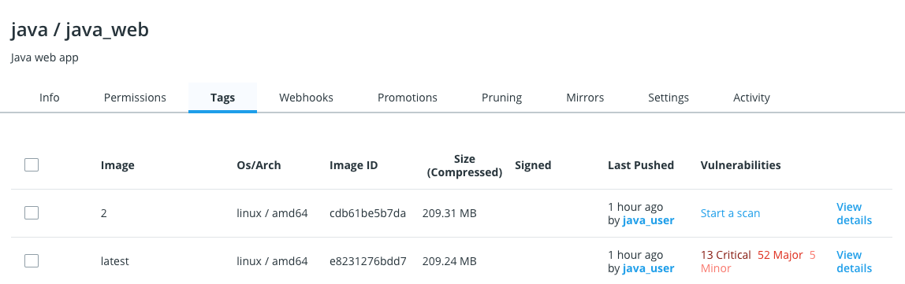

	> Note all the vulnerabilities found! This is due to  deliberately using an old version of the `tomcat` base image. 
	
	Most operating systems and many libraries contain some vulnerabilities. The details of these vulnerabilities and when they come into play are important. You can select `View details` to get additional information. Vulnerabilities within your image layers can be identified here. 

 	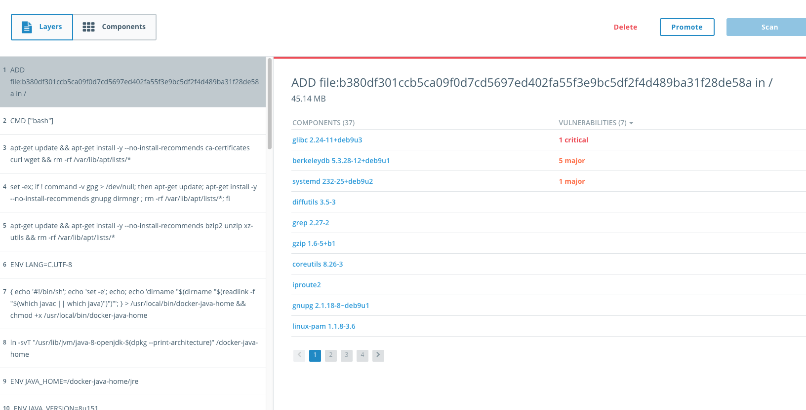

	By selecting `Components`, you can see what the vulnerabilities are and what components introduced the vulnerabilities. You can also select the vulnerabilities and examine them in the [Common Vulnerabilities and Exploits database](https://cve.mitre.org/).

 	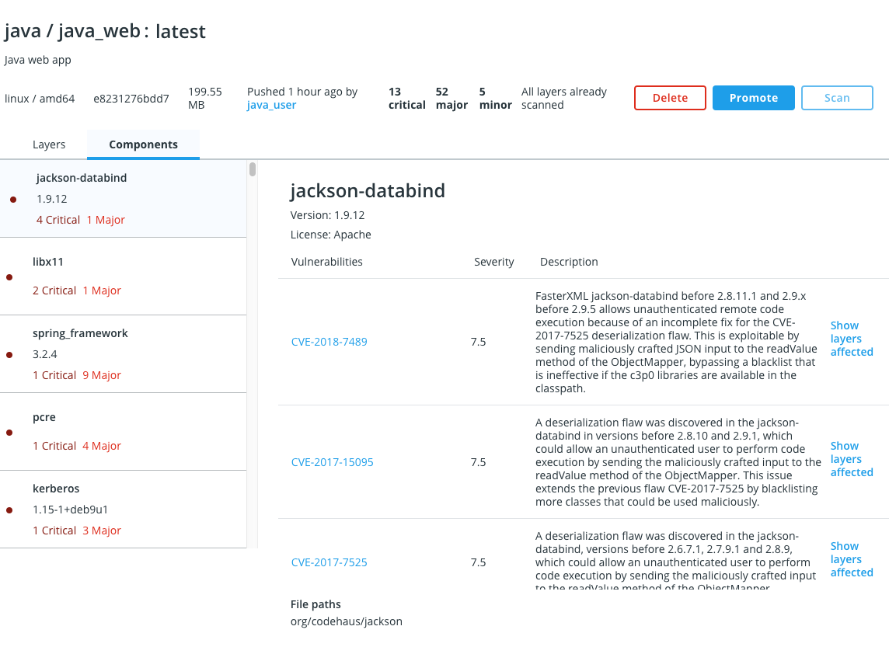

 3. Another way reduce your vulnerabilities is to identify the vulnerability origin. For example, you can see that in `java_web:latest`, 1 Critical and 9 Major issues were introduced with the Spring Framework. Time to upgrade that framework! Of course, upgrading the app is out of scope for this workshop, but you can see how this would give you the needed information to mitigate vulnerabilities.
 
 4. You can also choose newer base images. For example, you can revisit to the Dockerfile in the `~/hybrid-app/java-app` directory, and change the second base image to `9.0.13-jre11-slim`. Slim images in official images are generally based on lighter-weight operating systems like `Alpine Linux` or `Debian`, which have reduced attack vector. Then check the scanning again (this may again take 5-10 minutes). You might still see some vulnerabilities, however, there should be fewer.

5. To enable scanning of images automatically, select a repository. Navigate to the `Settings` tab and select `On Push` in the `Image Scanning` section. This will initiate a scan every time a new image is pushed to this repository.

	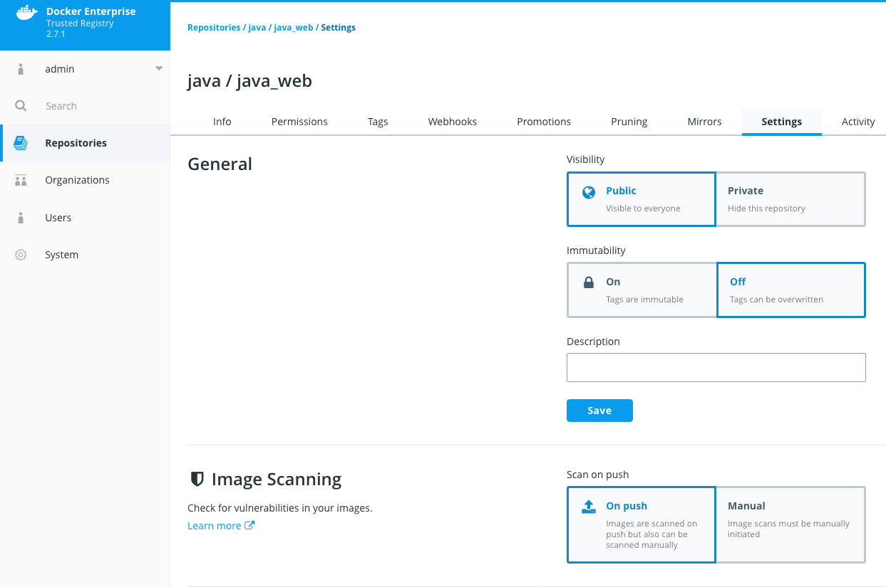


6. DTR also allows you to [Sign Images](https://docs.docker.com/datacenter/dtr/2.4/guides/user/manage-images/sign-images/) and [Create promotion policies](https://docs.docker.com/datacenter/dtr/2.4/guides/user/create-promotion-policies/) which prevent users from using images in production that don't meet your criteria,  including blocking images with critical and/or major vulnerabilities.

## Common Issues

* Confirm that you are setting the environmental variable DTR_HOST to the DTR hostname. The DTR hostname can be found in the PWD session information at the bottom of the PWD page.

## Conclusion

In this lab we've looked how Docker Enterprise can help you manage both Linux and Windows workloads whether they be traditional apps you've modernized or newer cloud-native apps, leveraging Swarm or Kubernetes for orchestration.

You can find more information on Docker Enterprise at [http://www.docker.com](http://www.docker.com/enterprise-edition) as well as continue exploring using our hosted trial at [https://dockertrial.com](https://dockertrial.com)
